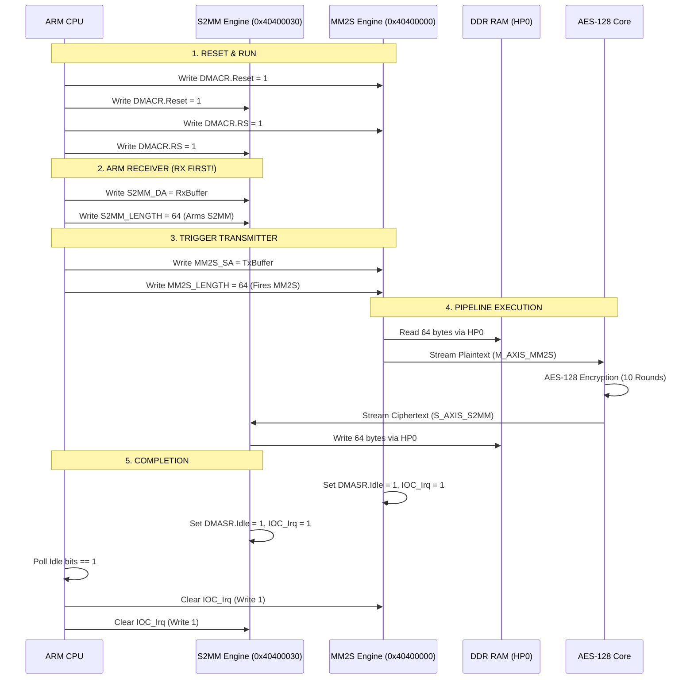

# Xilinx AXI DMA (v7.1) Complete Register, Bitfield & Memory Specification

**Target Hardware**: Xilinx Zynq-7000 (Pynq-Z2)  
**Vivado Core**: AXI Direct Memory Access (`xilinx.com:ip:axi_dma:7.1`)  
**Operating Mode**: Direct Register Mode (Simple DMA, `C_INCLUDE_SG = 0`)  
**Base Address in System**: `0x40400000`  
**Address Range**: `0x40400000 - 0x4040FFFF` (64 KB address space)  
**Control Interface**: 32-bit AXI4-Lite (`S_AXI_LITE` via `axi_interconnect_0`)  
**Master Data Interfaces**: `M_AXI_MM2S` and `M_AXI_S2MM` via `smartconnect_0` to PS7 DDR (`S_AXI_HP0`)

---

## 1. Complete Register Address Map

| Offset | Physical Address | Register Name | Access | Reset Value | Mode | Description |
| :--- | :--- | :--- | :---: | :---: | :---: | :--- |
| **`0x00`** | `0x40400000` | **`MM2S_DMACR`** | R/W | `0x00010002` | Both | MM2S DMA Control Register |
| **`0x04`** | `0x40400004` | **`MM2S_DMASR`** | R/W1C| `0x00000001` | Both | MM2S DMA Status Register |
| `0x08` | `0x40400008` | `MM2S_CURDESC` | R/W | `0x00000000` | SG Only | Current Descriptor Pointer (Unused in Direct Mode) |
| `0x0C` | `0x4040000C` | `MM2S_CURDESC_MSB` | R/W | `0x00000000` | SG Only | Upper 32-bit Current Descriptor Pointer |
| `0x10` | `0x40400010` | `MM2S_TAILDESC` | R/W | `0x00000000` | SG Only | Tail Descriptor Pointer |
| `0x14` | `0x40400014` | `MM2S_TAILDESC_MSB`| R/W | `0x00000000` | SG Only | Upper 32-bit Tail Descriptor Pointer |
| **`0x18`** | `0x40400018` | **`MM2S_SA`** | R/W | `0x00000000` | Direct | **MM2S Source Address** (Lower 32-bit DDR physical address) |
| `0x1C` | `0x4040001C` | `MM2S_SA_MSB` | R/W | `0x00000000` | Direct | MM2S Source Address Upper 32-bit (for 64-bit systems) |
| **`0x28`** | `0x40400028` | **`MM2S_LENGTH`** | R/W | `0x00000000` | Direct | **MM2S Transfer Length (bytes)** &mdash; Writing triggers TX |
| | | | | | | |
| **`0x30`** | `0x40400030` | **`S2MM_DMACR`** | R/W | `0x00010002` | Both | S2MM DMA Control Register |
| **`0x34`** | `0x40400034` | **`S2MM_DMASR`** | R/W1C| `0x00000001` | Both | S2MM DMA Status Register |
| `0x38` | `0x40400038` | `S2MM_CURDESC` | R/W | `0x00000000` | SG Only | Current Descriptor Pointer (Unused in Direct Mode) |
| `0x3C` | `0x4040003C` | `S2MM_CURDESC_MSB` | R/W | `0x00000000` | SG Only | Upper 32-bit Current Descriptor Pointer |
| `0x40` | `0x40400040` | `S2MM_TAILDESC` | R/W | `0x00000000` | SG Only | Tail Descriptor Pointer |
| `0x44` | `0x40400044` | `S2MM_TAILDESC_MSB`| R/W | `0x00000000` | SG Only | Upper 32-bit Tail Descriptor Pointer |
| **`0x48`** | `0x40400048` | **`S2MM_DA`** | R/W | `0x00000000` | Direct | **S2MM Destination Address** (Lower 32-bit DDR physical address)|
| `0x4C` | `0x4040004C` | `S2MM_DA_MSB` | R/W | `0x00000000` | Direct | S2MM Destination Address Upper 32-bit |
| **`0x58`** | `0x40400058` | **`S2MM_LENGTH`** | R/W | `0x00000000` | Direct | **S2MM Transfer Length (bytes)** &mdash; Writing triggers RX |

*Note: Legend for Access column:*
- **R/W**: Read and Write.
- **R/W1C**: Read, and Write-1-to-Clear (writing `1` clears the bit to `0`, writing `0` has no effect).
- **RO**: Read Only.

---

## 2. Bit-by-Bit Register Breakdown

### 2.1 MM2S_DMACR (MM2S DMA Control Register) &mdash; Offset `0x00`
Controls the operation of the Memory-to-Stream channel (Transmitter).

| Bits | Name | Access | Reset | Description |
| :---: | :--- | :---: | :---: | :--- |
| **`0`** | **`RS` (Run/Stop)** | R/W | `0` | **1 = Run**: DMA channel starts processing transfers. **0 = Stop**: DMA channel pauses/halts after completing the current burst. |
| `1` | `Reserved` | RO | `0` | Reserved. Always write 0. |
| **`2`** | **`Reset`** | R/W | `0` | **1 = Soft Reset**: Resets internal state machines, counters, and FIFOs. *Self-clearing*: Hardware resets this bit to `0` when reset finishes. |
| `3` | `Keyhole` | R/W | `0` | Keyhole read mode (transfers read from fixed address). Default: `0`. |
| `4` | `Cyclic BD Enable`| R/W | `0` | SG cyclic descriptor mode. Disabled in Direct Mode (`0`). |
| `11:5` | `Reserved` | RO | `0` | Reserved. |
| **`12`**| **`IOC_IrqEn`** | R/W | `0` | **Interrupt on Complete Enable**. `1` = Generate IRQ when a transfer finishes. `0` = Disable interrupt (used for software polling). |
| **`13`**| **`Dly_IrqEn`** | R/W | `0` | **Delay Interrupt Enable**. `1` = Generate IRQ on delay timer expiration. |
| **`14`**| **`Err_IrqEn`** | R/W | `0` | **Error Interrupt Enable**. `1` = Generate IRQ when any DMA error occurs. |
| `15` | `Reserved` | RO | `0` | Reserved. |
| `23:16`| `IRQThreshold` | R/W | `1` | Interrupt Coalescing Threshold (number of transfers before IRQ). |
| `31:24`| `IRQDelay` | R/W | `0` | Interrupt Delay Timeout (clock cycles before delay IRQ). |

---

### 2.2 MM2S_DMASR (MM2S DMA Status Register) &mdash; Offset `0x04`
Provides the live status, state machine phase, and error conditions of the MM2S channel.

| Bits | Name | Access | Reset | Description |
| :---: | :--- | :---: | :---: | :--- |
| **`0`** | **`Halted`** | RO | `1` | **1 = Halted**: Channel is stopped (`RS = 0` or during Reset). **0 = Running**: Channel is active (`RS = 1`) and ready for transfers. |
| **`1`** | **`Idle`** | RO | `0` | **1 = Idle**: No transfer currently in progress. **0 = Busy**: Active transfer underway across HP0 or AXI-Stream. |
| `2` | `Reserved` | RO | `0` | Reserved. |
| **`3`** | **`SGIncld`** | RO | `0` | **Scatter Gather Included Indicator**. `0` = Direct Register Mode (Current Core). `1` = Scatter-Gather Mode. |
| **`4`** | **`DMAIntErr`** | R/W1C | `0` | **DMA Internal Error**. `1` = Stream FIFO underflow, datapath error, or buffer misalignment. *Clear by writing `1`*. |
| **`5`** | **`DMASlvErr`** | R/W1C | `0` | **DMA Slave Error**. `1` = Slave device on AXI bus responded with `SLVERR` (e.g. inaccessible DDR address). *Clear by writing `1`*. |
| **`6`** | **`DMADecErr`** | R/W1C | `0` | **DMA Decode Error**. `1` = Slave address decode failed (`DECERR`) on HP0 memory bus. *Clear by writing `1`*. |
| `7` | `Reserved` | RO | `0` | Reserved. |
| `8` | `SGIntErr` | R/W1C | `0` | Scatter Gather Internal Error (SG Mode only). |
| `9` | `SGSlvErr` | R/W1C | `0` | Scatter Gather Slave Error (SG Mode only). |
| `10` | `SGDecErr` | R/W1C | `0` | Scatter Gather Decode Error (SG Mode only). |
| `11` | `Reserved` | RO | `0` | Reserved. |
| **`12`**| **`IOC_Irq`** | R/W1C | `0` | **Interrupt On Complete**. `1` = Transfer completed successfully (all bytes transferred). *Clear by writing `1`*. |
| **`13`**| **`Dly_Irq`** | R/W1C | `0` | **Delay Interrupt Flag**. `1` = Delay timer fired. *Clear by writing `1`*. |
| **`14`**| **`Err_Irq`** | R/W1C | `0` | **Error Interrupt Flag**. `1` = One or more error bits (4, 5, 6, 8, 9, 10) are set. *Clear by writing `1`*. |
| `15` | `Reserved` | RO | `0` | Reserved. |
| `23:16`| `IRQThresholdSts`| RO | `0` | Current interrupt threshold counter value. |
| `31:24`| `IRQDelaySts` | RO | `0` | Current interrupt delay counter value. |

---

### 2.3 MM2S_SA (MM2S Source Address) &mdash; Offset `0x18`
Specifies the physical start address in DDR memory from which plaintext will be fetched.

| Bits | Name | Access | Reset | Description |
| :---: | :--- | :---: | :---: | :--- |
| **`31:0`** | **`Source Address`** | R/W | `0x00000000` | 32-bit physical DDR address (e.g. `(UINTPTR)TxBuffer`). *Alignment*: For optimal AXI burst performance, align buffer to 32 or 64 bytes (`aligned(64)`). |

---

### 2.4 MM2S_LENGTH (MM2S Buffer Length) &mdash; Offset `0x28`
Specifies the total number of bytes to transmit across the `M_AXIS_MM2S` stream.

| Bits | Name | Access | Reset | Description |
| :---: | :--- | :---: | :---: | :--- |
| **`25:0`** | **`Length`** | R/W | `0x00000000` | **Transfer size in bytes** (1 to `67,108,863` bytes / 64 MB). ⚠️ **CRITICAL HARDWARE TRIGGER**: Writing a non-zero value to this register **initiates the MM2S DMA transfer immediately**. |
| `31:26`| `Reserved` | RO | `0` | Reserved. |

---

### 2.5 S2MM_DMACR (S2MM DMA Control Register) &mdash; Offset `0x30`
Controls the operation of the Stream-to-Memory channel (Receiver).

| Bits | Name | Access | Reset | Description |
| :---: | :--- | :---: | :---: | :--- |
| **`0`** | **`RS` (Run/Stop)** | R/W | `0` | **1 = Run**: Receiver channel enabled. **0 = Stop**: Receiver channel stopped. |
| `1` | `Reserved` | RO | `0` | Reserved. |
| **`2`** | **`Reset`** | R/W | `0` | **1 = Soft Reset**: Resets S2MM channel and clears internal FIFOs. *Self-clearing*. |
| `3` | `Keyhole` | R/W | `0` | Keyhole write mode. Default: `0`. |
| `11:4` | `Reserved` | RO | `0` | Reserved. |
| **`12`**| **`IOC_IrqEn`** | R/W | `0` | **Interrupt on Complete Enable** (S2MM). |
| **`13`**| **`Dly_IrqEn`** | R/W | `0` | **Delay Interrupt Enable** (S2MM). |
| **`14`**| **`Err_IrqEn`** | R/W | `0` | **Error Interrupt Enable** (S2MM). |
| `31:15`| `Reserved / Coalescing` | R/W | `0` | Threshold & Delay fields. |

---

### 2.6 S2MM_DMASR (S2MM DMA Status Register) &mdash; Offset `0x34`
Live status, state machine phase, and error conditions of the S2MM channel.

| Bits | Name | Access | Reset | Description |
| :---: | :--- | :---: | :---: | :--- |
| **`0`** | **`Halted`** | RO | `1` | **1 = Halted**: Receiver stopped. **0 = Running**: Receiver active. |
| **`1`** | **`Idle`** | RO | `0` | **1 = Idle**: Channel is not receiving data. **0 = Busy**: Channel is actively buffering or writing to DDR. |
| `2` | `Reserved` | RO | `0` | Reserved. |
| **`3`** | **`SGIncld`** | RO | `0` | `0` = Direct Register Mode. |
| **`4`** | **`DMAIntErr`** | R/W1C | `0` | **1 = S2MM Internal Error** (e.g. stream FIFO overflow). Write `1` to clear. |
| **`5`** | **`DMASlvErr`** | R/W1C | `0` | **1 = S2MM Slave Error** (HP0 bus error writing to DDR). Write `1` to clear. |
| **`6`** | **`DMADecErr`** | R/W1C | `0` | **1 = S2MM Decode Error** (invalid target address). Write `1` to clear. |
| `11:7` | `Reserved` | RO | `0` | Reserved. |
| **`12`**| **`IOC_Irq`** | R/W1C | `0` | **Interrupt On Complete**. `1` = S2MM transfer finished (`TLAST` asserted or byte count reached). Write `1` to clear. |
| **`13`**| **`Dly_Irq`** | R/W1C | `0` | Delay interrupt flag. Write `1` to clear. |
| **`14`**| **`Err_Irq`** | R/W1C | `0` | Error interrupt flag. Write `1` to clear. |
| `31:15`| `Reserved / Status` | RO | `0` | Reserved. |

---

### 2.7 S2MM_DA (S2MM Destination Address) &mdash; Offset `0x48`
Specifies the physical start address in DDR memory where ciphertext will be written.

| Bits | Name | Access | Reset | Description |
| :---: | :--- | :---: | :---: | :--- |
| **`31:0`** | **`Destination Address`**| R/W | `0x00000000` | 32-bit physical DDR address (e.g. `(UINTPTR)RxBuffer`). *Alignment*: Align buffer to 32 or 64 bytes (`aligned(64)`). |

---

### 2.8 S2MM_LENGTH (S2MM Buffer Length) &mdash; Offset `0x58`
Specifies the total number of bytes expected to receive from the `S_AXIS_S2MM` stream.

| Bits | Name | Access | Reset | Description |
| :---: | :--- | :---: | :---: | :--- |
| **`25:0`** | **`Length`** | R/W | `0x00000000` | **Receive buffer size in bytes**. ⚠️ **CRITICAL HARDWARE TRIGGER**: Writing a non-zero value to this register **arms the S2MM channel to capture stream data**. |
| `31:26`| `Reserved` | RO | `0` | Reserved. |

---

## 3. AES-128 IP Control Registers (Base Address: `0x40000000`)

For full system reference, the memory-mapped control registers of the AES IP are:

| Offset | Physical Address | Register Name | Access | Description |
| :---: | :---: | :--- | :---: | :--- |
| `0x00` | `0x40000000` | `KEY_0` | R/W | AES-128 Encryption Key Bits [31:0] |
| `0x04` | `0x40000004` | `KEY_1` | R/W | AES-128 Encryption Key Bits [63:32] |
| `0x08` | `0x40000008` | `KEY_2` | R/W | AES-128 Encryption Key Bits [95:64] |
| `0x0C` | `0x4000000C` | `KEY_3` | R/W | AES-128 Encryption Key Bits [127:96] |
| `0x14` | `0x40000014` | `AES_CTRL` | R/W | Bit 0 = `1`: Start Key Expansion pulse |
| `0x18` | `0x40000018` | `AES_STATUS` | RO | Bit 1 = `1`: Key Expansion complete and ready |

---

## 4. Hardware Operational Sequence Summary

